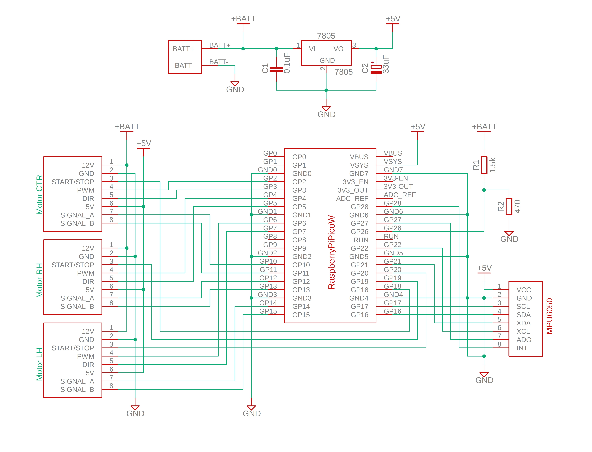

# 🔌 回路図・配線ガイド

> Raspberry Pi Pico W ベース（2号機）の回路構成

---

## 回路図



---

## システム構成図

```
                    ┌─────────────┐
    +BATT (11.1V)──→│   7805      │──→ +5V
                    │  C1=0.1µF   │      │
                    │  C2=33µF    │      ├──→ Pico W (VSYS)
                    └─────────────┘      ├──→ MPU6050 (VCC)
                         │               └──→ Motor 1,2,3 (Pin6: 5V)
                         │
              R1=1.5kΩ ──┤
                         ├──→ GP26 (ADC: バッテリー電圧)
              R2=470Ω  ──┤
                         │
                        GND

    ┌──────────────┐     I2C     ┌──────────┐
    │ Pico W       │────────────→│ MPU6050  │
    │  GP16 (SDA)  │  SDA        │  0x68    │
    │  GP17 (SCL)  │  SCL        └──────────┘
    │              │
    │  GP2  (PWM)  │──→ Motor CTR (Pin4)
    │  GP3  (DIR)  │──→ Motor CTR (Pin5)
    │  GP18 (SS)   │──→ Motor CTR (Pin3)
    │  GP10 (ENCA) │←── Motor CTR (Pin7)
    │  GP11 (ENCB) │←── Motor CTR (Pin8)
    │              │
    │  GP4  (PWM)  │──→ Motor RH  (Pin4)
    │  GP5  (DIR)  │──→ Motor RH  (Pin5)
    │  GP19 (SS)   │──→ Motor RH  (Pin3)
    │  GP12 (ENCA) │←── Motor RH  (Pin7)
    │  GP13 (ENCB) │←── Motor RH  (Pin8)
    │              │
    │  GP6  (PWM)  │──→ Motor LH  (Pin4)
    │  GP7  (DIR)  │──→ Motor LH  (Pin5)
    │  GP20 (SS)   │──→ Motor LH  (Pin3)
    │  GP14 (ENCA) │←── Motor LH  (Pin7)
    │  GP15 (ENCB) │←── Motor LH  (Pin8)
    └──────────────┘
```

---

## Raspberry Pi Pico W ピンアサイン

```
                ┌─────────────┐
       GP0  ────┤ 1        40 ├──── VBUS
       GP1  ────┤ 2        39 ├──── VSYS ← +5V
      GND0  ────┤ 3        38 ├──── GND
  CTR PWM → GP2 ┤ 4        37 ├──── 3V3_EN
  CTR DIR → GP3 ┤ 5        36 ├──── 3V3_OUT
   RH PWM → GP4 ┤ 6        35 ├──── ADC_REF
   RH DIR → GP5 ┤ 7        34 ├──── GP28
      GND1  ────┤ 8        33 ├──── GND
   LH PWM → GP6 ┤ 9        32 ├──── GP27
   LH DIR → GP7 ┤10        31 ├──── GP26 ← BATT ADC
       GP8  ────┤11        30 ├──── RUN
       GP9  ────┤12        29 ├──── GP22
      GND2  ────┤13        28 ├──── GND
 CTR ENC A → GP10┤14       27 ├──── GP21
 CTR ENC B → GP11┤15       26 ├──── GP20 ← LH SS
  RH ENC A → GP12┤16       25 ├──── GP19 ← RH SS
  RH ENC B → GP13┤17       24 ├──── GP18 ← CTR SS
      GND3  ────┤18        23 ├──── GND
 LH ENC A → GP14┤19       22 ├──── GP17 ← I2C SCL
 LH ENC B → GP15┤20       21 ├──── GP16 ← I2C SDA
                └─────────────┘
```

---

## モーター8ピンコネクタ配線表

| ピン | 信号名 | Motor CTR | Motor RH | Motor LH |
|:---:|--------|:---------:|:--------:|:--------:|
| 1 | +12V (モーター電源) | +BATT | +BATT | +BATT |
| 2 | GND | GND | GND | GND |
| 3 | START/STOP (SS) | GP18 | GP19 | GP20 |
| 4 | PWM (速度制御) | GP2 | GP4 | GP6 |
| 5 | DIR (方向) | GP3 | GP5 | GP7 |
| 6 | +5V (エンコーダ電源) | +5V | +5V | +5V |
| 7 | SIGNAL_A (エンコーダ) | GP10 | GP12 | GP14 |
| 8 | SIGNAL_B (エンコーダ) | GP11 | GP13 | GP15 |

---

## バッテリー電圧モニタ回路

```
+BATT (11.1V) ─── R1 (1.5kΩ) ──┬── R2 (470Ω) ─── GND
                                 │
                                 └── GP26 (ADC入力)
```

**分圧計算:**

$$V_{ADC} = V_{BATT} \times \frac{R_2}{R_1 + R_2} = V_{BATT} \times \frac{470}{1500 + 470}$$

| バッテリー状態 | V_BATT | V_ADC | ADC値 (12bit) |
|:---:|:---:|:---:|:---:|
| 満充電 | 12.6V | 3.00V | 3723 |
| 定格 | 11.1V | 2.65V | 3281 |
| 要充電 | 9.9V | 2.36V | 2927 |

---

## PCB発注手順（JLCPCB）

1. [JLCPCB](https://jlcpcb.com/) にアカウント作成
2. 「Order Now」→「Add Gerber File」
3. `hardware/gerber/` フォルダ内の全ファイルをZIPにまとめてアップロード
4. 基板設定:
   - Layers: 2
   - PCB Qty: 5（最小ロット）
   - PCB Color: お好みで
   - Surface Finish: HASL(有鉛) が最安
5. 注文・決済（$2〜5 + 送料）
6. 到着まで約1-2週間
